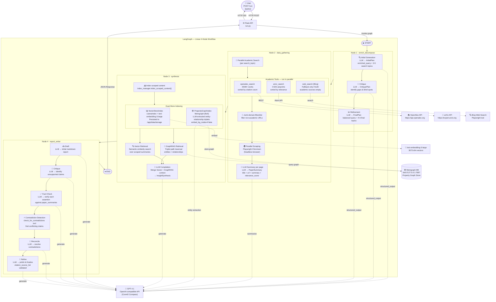
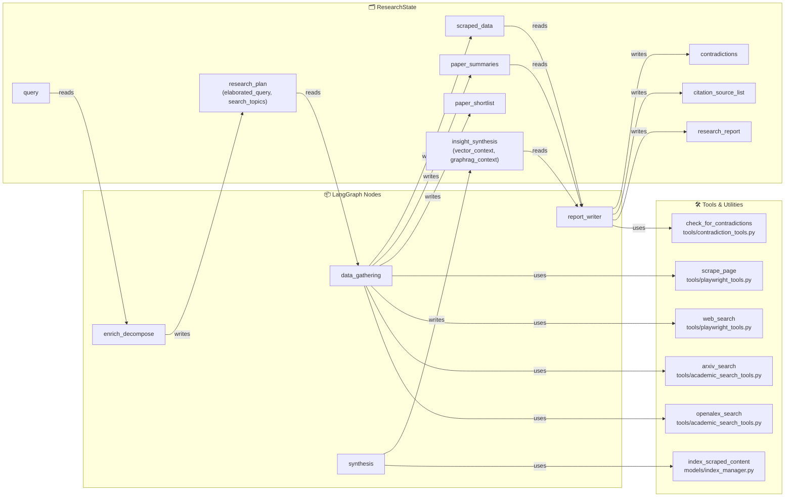

# Deep Research Flow Agent 🚀

A containerized, multi-agent Deep Research orchestrator built using **LangGraph**, **LlamaIndex**, **Memgraph (GraphRAG)**, **Flask**, and **Playwright Chromium**. 

The agent conducts autonomous query decomposition, parallel Bing searches, live Playwright SPA scraping, vector and property graph ingestion, GraphRAG path lookups, peer-reviewed fact-checking, and final publication-ready report drafting.

---

## 🛠️ Architecture Overview

The system runs a **4-node linear LangGraph workflow**:
1. 🔍 **Enrich & Decompose (Node 1):** Elaborates query viewpoints (points vs counter-points) and decomposes them into precise search terms.
2. 🌐 **Data Gathering (Node 2):** Performs parallel web searches, scrapes pages concurrently using Playwright Chromium, and compiles individual paper summaries.
3. 🧠 **Synthesis (Node 3):** Indexes scraped documents into LlamaIndex's Vector Store and extracts entity-relationship triplets into the **Memgraph** Graph Database, synthesizing Vector + GraphRAG insights.
4. 📝 **Report Writer (Node 4):** Executes a strict self-correction loop (Draft -> Critique -> Fact-Check assertions -> Reconcile contradictions -> Refine) to produce the final citation-grounded report.

---

## Graph Overview

```
START
  │
  ▼
┌─────────────────────────────────────────────────────────────┐
│  Node 1 · enrich_decompose                                  │
│  Tools : (none — pure LLM reasoning)                        │
│  Output: enriched_query, search_topics, research_plan       │
└─────────────────────────────────────────────────────────────┘
  │
  ▼
┌─────────────────────────────────────────────────────────────┐
│  Node 2 · data_gathering                                    │
│  Tools : openalex_search   (academic_search_tools.py)       │
│          arxiv_search      (academic_search_tools.py)       │
│          web_search        (playwright_tools.py) [fallback] │
│          scrape_page       (playwright_tools.py)            │
│  Output: paper_shortlist, paper_summaries, scraped_data     │
└─────────────────────────────────────────────────────────────┘
  │
  ▼
┌─────────────────────────────────────────────────────────────┐
│  Node 3 · synthesis                                         │
│  Tools : index_scraped_content  (index_manager.py)          │
│          VectorStoreIndex query (index_manager.py)          │
│          PropertyGraphIndex query — GraphRAG (index_manager)│
│  Output: insight_synthesis                                  │
└─────────────────────────────────────────────────────────────┘
  │
  ▼
┌─────────────────────────────────────────────────────────────┐
│  Node 4 · report_writer                                     │
│  Tools : fact_checker          (llamaindex_tools.py)        │
│          resolve_contradiction (contradiction_tools.py)     │
│            └─ internally uses web_search + scrape_page      │
│  Output: research_report, citation_source_list              │
└─────────────────────────────────────────────────────────────┘
  │
  ▼
 END
```

---

## 🗺️ Architecture Flowchart

### Full LangGraph Workflow



---

### Tool Interaction Map



---

## ⚙️ Environment Setup

Create a `.env` file in the root directory (based on `.env.example`). For standard production execution on Core42's Compass gateway, configure the following:

```env
OPENAI_API_KEY="your-core42-compass-api-key"
OPENAI_BASE_URL="https://api.core42.ai/v1"
OPENAI_MODEL="gpt-4.1"
EMBEDDING_MODEL="text-embedding-3-large"
```

---

## 🐳 Building and Running the System

### 1. Build and Run with the Entrypoint Script
```bash
./entrypoint.sh
```

---

## 📊 Viewing Logs and Telemetry

The application uses **structured JSON logging** inside Docker and pretty logs locally. The custom logger instruments token counters (input, output, and total tokens) and execution durations for every step.

### View Container Logs
```bash
docker logs <container-id>
```

### Stream Live Logs in Real-time
```bash
docker logs -f <container-id>
```

Inside the container, the supervisor script writes:
- API logs to `/app/logs/app.log`
- Memgraph logs to `/app/logs/memgraph.log`

---

## 🚀 Triggering Deep Research (API Endpoints)

The Flask web server is hosted on port **`8000`** inside the container and mapped directly to your localhost.

### 1. Standard Submission Endpoint
*   **URL:** `http://localhost:8000/run`
*   **Method:** `POST`
*   **Headers:** `Content-Type: application/json`
*   **Request Body:**
    ```json
    {
      "query": "Should artificial intelligence coding assistants write code autonomously?"
    }
    ```

**Example Curl Command:**
```bash
curl -X POST -H "Content-Type: application/json" \
     -d '{"query": "Should artificial intelligence coding assistants write code autonomously?"}' \
     http://localhost:8000/run
```

**Expected Response Layout:**
Returns the standardized Agentathon response:
*   `status`: success/error.
*   `use_case_id`: selected challenge ID.
*   `result.summary`: user-facing summary output.
*   `result.recommendations`: actionable recommendations.
*   `result.artifacts`: references/citation artifacts.
*   `agents_used`: workflow roles.
*   `trace_id`: execution trace identifier.
*   `runtime_seconds`: end-to-end runtime.

### 2. Service Health Status Endpoint
*   **URL:** `http://localhost:8000/`
*   **Method:** `GET`

**Example Curl Command:**
```bash
curl -s http://localhost:8000/
```

---

## 🧪 Verification and Test Suite

You can execute node-specific and end-to-end integration tests directly inside the running single container:

### 1. Run Synthesis Verification (Node 3)
```bash
docker exec -it <container-id> python tests/test_synthesis.py
```

### 2. Run Report Writer Verification (Node 4)
```bash
docker exec -it <container-id> python tests/test_report_writer.py
```

### 3. Run End-to-End Integration Verification
Runs the entire LangGraph workflow from search to the final fact-checked report:
```bash
docker exec -it <container-id> python tests/test_end_to_end.py
```

---

## 📁 Submission Artifacts

The repository includes the mandatory submission assets:
- `app/` for submission-facing orchestration helpers.
- `input_examples/` with at least 3 reproducible request payloads.
- `output_examples/` with at least 3 matching structured outputs.
- `logs/` with sample agent interaction traces.
