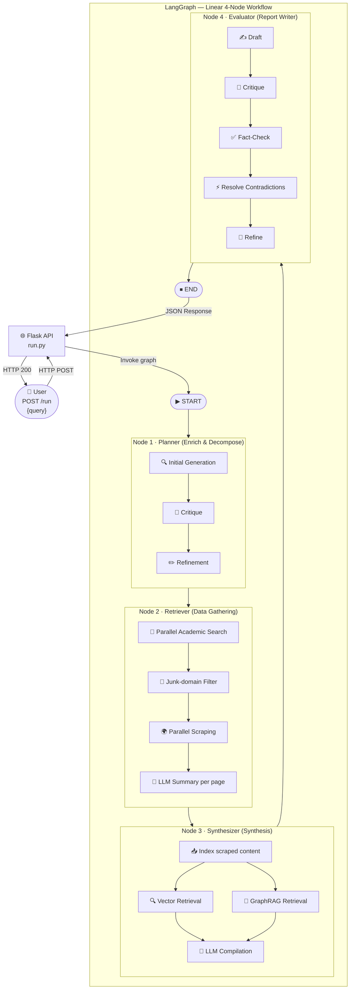

# Deep Research Flow Agent 🚀

## 1. Problem Statement
Researchers and analysts often struggle to synthesize information from disparate academic and web sources while maintaining high factual accuracy and avoiding hallucinations. There is a need for an autonomous system that can decompose complex queries, gather diverse evidence, reconcile contradictions, and produce publication-ready reports with verifiable citations.

## 2. Use Case ID
16

## 3. Solution Overview
The Deep Research Flow Agent is a containerized, multi-agent orchestrator that automates the end-to-end research process. It utilizes a linear LangGraph workflow to transform a high-level user query into a comprehensive, fact-checked research report. The system combines traditional semantic search (Vector RAG) with Knowledge Graph traversal (GraphRAG) to provide deep insights and rigorous verification.

## 4. Agent Architecture
The system is implemented as a 4-node LangGraph workflow, where each node acts as a specialized agent:

### Agents & Roles
- **Planner (Node 1 - Enrich & Decompose):** Acts as the research director. It elaborates the user query into multiple viewpoints (points vs. counter-points) and decomposes it into precise search topics.
- **Retriever (Node 2 - Data Gathering):** Acts as the evidence collector. It performs parallel searches across OpenAlex and arXiv, falling back to Bing web search, and scrapes content using Playwright Chromium.
- **Synthesizer (Node 3 - Synthesis):** Acts as the knowledge engineer. It indexes scraped content into a dual-store architecture (LlamaIndex Vector Store and Memgraph Property Graph), synthesizing insights from both.
- **Evaluator (Node 4 - Report Writer):** Acts as the principal scientist and peer reviewer. It executes an iterative loop of drafting, critiquing, fact-checking, and refining the final report.

### System Design
- **Communication:** Agents communicate asynchronously via a shared `ResearchState` object, which carries the query, research plan, scraped data, and synthesized insights.
- **Decision-Making:** The overall flow is linear, but internal decision-making occurs within nodes using LLM-driven loops (e.g., the Planner's critique-refine loop and the Evaluator's fact-check-refine loop).
- **Critique & Validation:** The system employs a "Generate-Critique-Verify" pattern. Node 4 specifically uses a `fact_checker` tool to verify assertions against the retrieved evidence before finalization.
- **Memory & RAG:** The system uses a Hybrid RAG approach:
    - **Vector RAG:** LlamaIndex for semantic similarity search.
    - **GraphRAG:** Memgraph for entity-relationship traversal and structural insights.
- **Failures & Fallbacks:** 
    - Search fallback: Academic sources $\rightarrow$ Bing Search.
    - Scraper fallback: Invalid or junk URLs are filtered and dropped.
    - LLM fallback: Structured output failures trigger simplified fallback generators to prevent workflow crashes.

## 5. Agent Collaboration Flow
The collaboration follows a strict sequential pipeline to ensure that each stage builds upon verified data from the previous one.



## 6. Tools, Frameworks, and Models Used
- **Orchestration:** LangGraph
- **LLM:** GPT-4.1 (via Core42 Compass API)
- **Embeddings:** `text-embedding-3-large`
- **RAG Framework:** LlamaIndex
- **Graph Database:** Memgraph (Property Graph)
- **Web Automation:** Playwright Chromium
- **API Framework:** Flask
- **Language:** Python 3.11

## 7. Data Sources
- **OpenAlex API:** For peer-reviewed academic works.
- **arXiv API:** For CS/AI/ML preprints.
- **Bing Search:** As a general web fallback.
- **Live Web Pages:** Scraped via Playwright for full-text analysis.

## 8. Repository Structure
```text
.
├── app/                # API orchestration and workflow logic
├── graphs/             # LangGraph definitions
│   ├── nodes/          # Agent node implementations (Planner, Retriever, etc.)
│   ├── orchestrator.py # Graph construction
│   └── state.py        # Shared state definition
├── models/             # RAG and LLM management
│   └── index_manager.py# Vector & Graph indexing logic
├── tools/              # Specialist tools for search, scraping, and fact-checking
├── utils/              # Logging and metadata helpers
├── tests/              # Node-level and end-to-end integration tests
├── input_examples/     # Sample request payloads
├── output_examples/    # Sample structured responses
├── logs/               # Execution traces and application logs
├── run.py              # Flask entry point
├── Dockerfile          # Container definition
└── docker-compose.yml  # Multi-service setup (App + Memgraph)
```

## 9. Environment Variables
The application requires specific API credentials to function. You must set these either as system environment variables or within a `.env` file in the root directory.

**Required Variables:**
- `OPENAI_API_KEY`: Your Core42 Compass API key.
- `OPENAI_BASE_URL`: The API base URL (e.g., `https://api.core42.ai/v1`).

**Optional/Default Variables:**
- `OPENAI_MODEL`: Model to use (default: `gpt-4.1`).
- `EMBEDDING_MODEL`: Embedding model (default: `text-embedding-3-large`).
- `MEMGRAPH_URI`: Connection string for Memgraph (default: `bolt://memgraph:7687`).
- `USE_CASE_ID`: The challenge ID (default: `16`).

Example `.env` file:
```env
OPENAI_API_KEY="your-core42-compass-api-key"
OPENAI_BASE_URL="https://api.core42.ai/v1"
OPENAI_MODEL="gpt-4.1"
EMBEDDING_MODEL="text-embedding-3-large"
MEMGRAPH_URI="bolt://memgraph:7687"
USE_CASE_ID="16"
```

## 10. Setup Instructions
1. Clone the repository.
2. Install Python 3.11.
3. Install dependencies: `pip install -r requirements.txt`.
4. Configure the `.env` file with your API keys.

## 11. How to Run Locally
For local development (excluding Memgraph GraphRAG features):
```bash
python run.py
```
The server will start at `http://localhost:8000`.

## 12. How to Run with Docker
The recommended way to run the full system (including Memgraph) is using the provided entrypoint script, which handles the build and orchestration of the containerized services:

```bash
./entrypoint.sh
```
This script executes `docker compose up --build`, starting the `app` and `memgraph` containers.

## 13. API Usage
### Standard Submission Endpoint
- **URL:** `http://localhost:8000/run`
- **Method:** `POST`
- **Headers:** `Content-Type: application/json`
- **Request Body:**
  ```json
  {
    "query": "Effects of LLMs on mental health and skill development"
  }
  ```

### Health Check
- **URL:** `http://localhost:8000/`
- **Method:** `GET`

## 14. Input and Output Examples
Samples are provided in the `/input_examples` and `/output_examples` directories. The system returns a structured JSON response including a summary, recommendations, and a list of artifacts (citations).

## 15. Logs and Traces
- **Stdout:** Real-time structured logs.
- **File Logs:** Mirrored to `logs/app.log`.
- **Telemetry:** The custom logger tracks token usage and execution duration for every agent step.

## 16. Demo Video
[Link to Demo Video]

## 17. Known Limitations
- **Scraping Blocks:** Some websites may block Playwright; the system relies on academic APIs to mitigate this.
- **Context Window:** Extremely long scraped pages are truncated to 4000 characters to fit LLM context limits.
- **Linearity:** The current graph is linear; it does not currently loop back from the Evaluator to the Retriever if information is found to be insufficient.

## 18. Future Improvements
- **Iterative Retrieval:** Implement a feedback loop between the Evaluator and Retriever to fill information gaps.
- **Advanced GraphRAG:** Implement more complex Cypher queries for deeper relationship analysis.
- **Asynchronous API:** Move from Flask to FastAPI with Celery/Redis for long-running research tasks.
